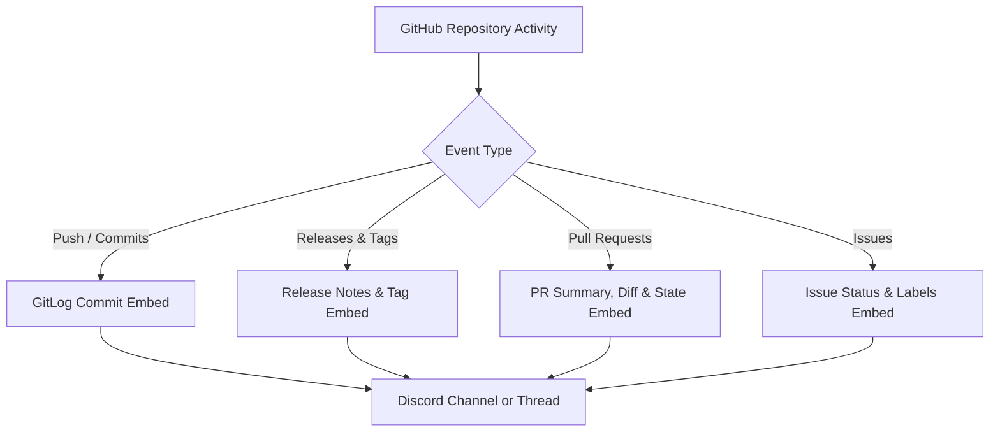

# 🐙 GitHub Repository Feeds

HELIX Discord Bot includes a native **GitHub Feeds** engine that delivers developer-grade GitLog activity updates directly into Discord channels and threads — **with zero API keys, personal access tokens, or rate limit hurdles**.

---

## ⚡ Key Highlights

- **Zero API Key Requirement**: Automatically monitors public repository activity via public GitHub Atom syndication feeds (`commits.atom`, `releases.atom`) and the public Events API (`/repos/{owner}/{repo}/events`). No Personal Access Token (PAT) or GitHub OAuth application is required.
- **Developer-Grade GitLog Embeds**: Formats commit pushes, release tags, pull requests, and issues with clean developer metadata — short SHA hashes, commit author avatars, branch badges, file diff stats (`+X -Y across Z commits`), and direct markdown links.
- **Granular Event Filtering**: Pick and choose exactly which event types you want to follow per repository (`push`, `release`, `pr`, `issues`).
- **Real-Time Push via Webhooks (Optional)**: In addition to automated background polling, the bot provides an incoming webhook receiver endpoint (`POST /api/feeds/webhooks/github`) for instant, 0-second real-time dispatch from GitHub repository settings.
- **Thread Delivery Integration**: Deliver commits and PR notifications to dedicated channel threads (e.g. `#dev-log > owner/repo`) to keep main chat channels organized.

---

## 🧭 Supported GitHub Event Types



| Event Type | Filter Alias | Description | Discord Embed Styling |
| :--- | :--- | :--- | :--- |
| **Commits / Pushes** | `push`, `commits` | Pushed commits to any branch or tag | Purple accent (`#7952D7`), branch pill badge (`main`), commit list with short SHAs (`a1b2c3d`), author avatars, and diff summaries. |
| **Releases & Tags** | `release`, `releases` | Published releases and annotated git tags | Green accent (`#2DA44E`), tag badge, release title, published timestamp, and changelog excerpt. |
| **Pull Requests** | `pr`, `pull_request` | Opened, merged, or closed pull requests | Blue accent (`#1F6FEB`), PR number badge (`#42`), author profile, branch merge direction (`feat -> main`), and diff stats. |
| **Issues** | `issues`, `issue` | Opened, closed, or updated repository issues | Red accent (`#D73A49`), issue number badge (`#108`), issue author, labels, and issue description excerpt. |

---

## 🖥️ Dashboard Configuration

Configuring GitHub repository feeds is done directly from the **GitHub Feeds** tab in the web dashboard.

### 1. Add Repository Feed
1. Open the web dashboard and select your Discord server from the server selector.
2. Click **GitHub Feeds** in the sidebar.
3. Enter the repository slug (e.g. `torvalds/linux`, `facebook/react`) or a full GitHub URL (`https://github.com/owner/repo`).
4. Select the target Discord channel.
5. *(Optional)* Select a notification role to ping on new updates.
6. Check one or more event types you wish to receive (`Commits / Pushes`, `Releases & Tags`, `Pull Requests`, `Issues`).
7. Click **Add GitHub Feed**.

---

## 🚀 Real-Time Webhook Setup (Optional)

By default, HELIX Discord Bot checks repository activity automatically on every background polling cycle (`POLL_INTERVAL_MS=60000`). If you are a maintainer or administrator of the repository and want **instantaneous 0-delay updates**, configure a GitHub repository webhook:

1. Navigate to your GitHub repository → **Settings** → **Webhooks** → **Add webhook**.
2. Set **Payload URL** to:
   ```
   https://<your-helix-domain>/api/feeds/webhooks/github
   ```
3. Set **Content type** to `application/json`.
4. Leave **Secret** empty (or as configured).
5. Under **Which events would you like to trigger this webhook?**, select:
   - **Let me select individual events**: Check `Pushes`, `Releases`, `Pull requests`, and `Issues`.
6. Click **Add webhook**.

Whenever GitHub fires a webhook event, HELIX Discord Bot instantly matches the repository slug against active feeds, applies the feed's event filters, and dispatches the rich Discord embed immediately to your configured channels or threads.

---

## 📊 Subscription Limits

By default, each Discord server user can configure up to **10 GitHub feeds**.

This limit can be customized or made unlimited via the `FEED_CATEGORY_LIMITS` configuration variable:
```env
FEED_CATEGORY_LIMITS=rss=10,reddit=10,github=15
```
Setting `github=0` removes the subscription cap for GitHub feeds entirely.
