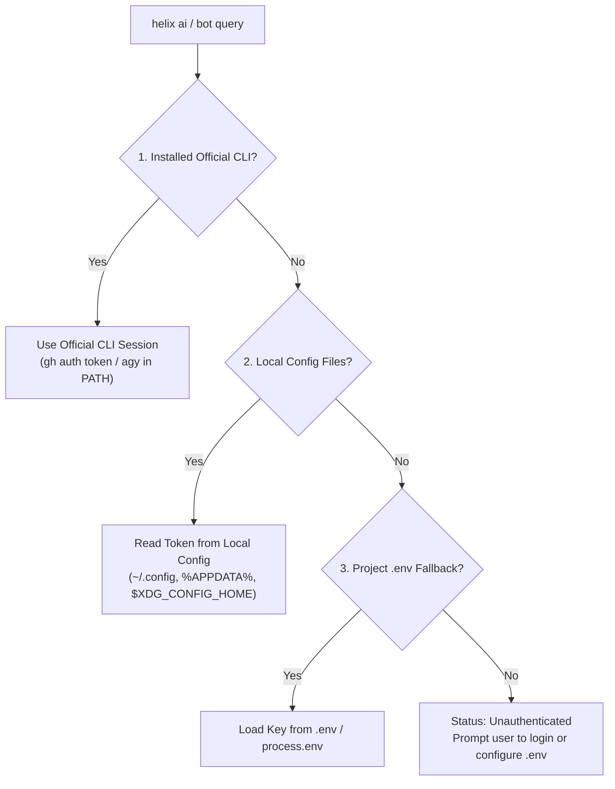

# Multi-Tiered AI Integration

HELIX connects to your existing local AI coding assistants without requiring extra API keys.

---

## 1. Local Tool Discovery

HELIX scans local configuration files and official CLI authentications:
1. **Google Antigravity**: Checks local config path `~/.gemini/antigravity`, `%APPDATA%`, and active `agy` CLI session.
2. **GitHub Copilot**: Resolves credentials directly via GitHub CLI (`gh auth token`) and local `hosts.json`.
3. **Open Code Go / Zen**: Detects active session tokens in `~/.opencode/auth.json` or `opencode` CLI.



---

## 2. Fallback Mechanism

If no local AI client is active, HELIX gracefully falls back to `.env`:
```dotenv
GEMINI_API_KEY=your_key_here
GITHUB_TOKEN=your_token_here
OPENCODE_API_KEY=your_key_here
```

---

## 3. CLI & Discord AI Queries

- Run `helix ai query "<question>"` from your terminal.
- Run `/helix-ai prompt:<question>` directly from your Discord server.
- Prompt directly from the browser inside the Web Dashboard AI Playground.
