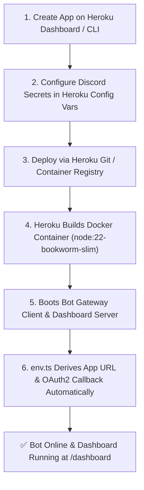

# Heroku Docker Deployment

Deploy HELIX to Heroku using the Heroku Container stack (`Dockerfile` + `heroku.yml`) on a single Eco Dyno with zero required paid add-ons.

---

## Deployment Architecture



---

## Step-by-Step Deployment

### 1. Create a Heroku App
Create an app on the Heroku Dashboard (**New** → **Create new app**) or via the Heroku CLI:
```bash
heroku create <your-app-name> --stack container
```

### 2. Configure Environment Variables
In the Heroku Dashboard (**Settings** → **Reveal Config Vars**) or via CLI, configure your Discord credentials:

| Config Var | Description | Required? | Source in Discord Developer Portal |
|---|---|---|---|
| `DISCORD_TOKEN` | Bot user token | **Yes** | **Bot** tab → *Reset Token* |
| `DISCORD_CLIENT_ID` | Application client ID | **Yes** | **General Information** → *Application ID* |
| `DISCORD_CLIENT_SECRET` | OAuth2 secret for Dashboard | **Yes** | **OAuth2** → **General** → *Client Secret* |
| `NEXTAUTH_SECRET` | 32+ character HMAC signing key | **Yes** | Generate with `openssl rand -base64 32` |
| `HELIX_DEFAULT_PREFIX` | Default message prefix | Optional | Defaults to `>` (customizable per-guild) |
| `HELIX_LOG_LEVEL` | Logger verbosity | Optional | Defaults to `info` |

> [!NOTE]
> All URLs (`NEXTAUTH_URL`, `DISCORD_CALLBACK_URL`, and invite links) and `PORT` are **auto-detected dynamically** from `HEROKU_APP_NAME` and Heroku port allocation. You do not need to set those manually.

### 3. Configure Discord OAuth2 Redirect URI
In the [Discord Developer Portal](https://discord.com/developers/applications):
1. Navigate to your Application → **OAuth2** → **Redirects**.
2. Add your Heroku callback URL:
   ```
   https://<your-app-name>.herokuapp.com/api/auth/callback/discord
   ```
3. Click **Save Changes**.

### 4. Deploy the Container

#### Option A: Deploy via Heroku Git (Recommended)
```bash
# Add Heroku git remote
heroku git:remote -a <your-app-name>

# Push and trigger container build
git push heroku main
```

#### Option B: Deploy via Heroku Container Registry
```bash
# Log in to Heroku Container Registry
heroku container:login

# Build and push the Docker image
heroku container:push web -a <your-app-name>

# Release the container
heroku container:release web -a <your-app-name>
```

### 5. Verify & View Logs
```bash
# Stream live logs from the bot
heroku logs --tail -a <your-app-name>

# Open the companion web dashboard
heroku open dashboard -a <your-app-name>
```

---

## Database & Persistence Note

`BotDatabase` creates `data/helix-bot.sqlite` and executes autonomous forward schema migrations on boot. Note that default Heroku Eco Dynos feature an ephemeral filesystem. For persistent multi-restart storage on Heroku, mount an external volume or configure `DISCORD_DB_PATH` to point to a persistent store.
