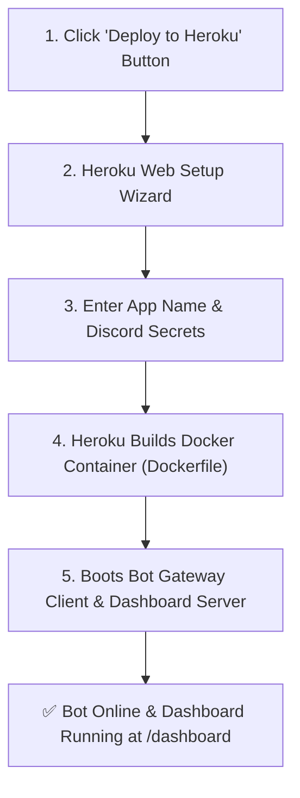

# Heroku 1-Click & Docker Deployment

Deploy HELIX to Heroku in one click using Heroku Container stack (`Dockerfile`) on a single Eco Dyno with zero required add-ons.

[](https://heroku.com/deploy?template=https://github.com/HELIX-Origin/HELIX)

---

## 1-Click Deployment Flow



---

## Step-by-Step Walkthrough

### 1. Launch Heroku Setup
Click the **[Deploy to Heroku](https://heroku.com/deploy?template=https://github.com/HELIX-Origin/HELIX)** button above. Heroku reads `app.json` and opens the application creation form.

### 2. Enter App Name & Select Region
- **App name**: Choose a unique name (e.g., `my-helix-bot`). Your dashboard will be hosted at `https://my-helix-bot.herokuapp.com/dashboard`.
- **Region**: Select United States or Europe.

### 3. Provide Required Config Vars
Fill in your credentials from the [Discord Developer Portal](https://discord.com/developers/applications):

| Variable | Description | Required? | Source in Discord Portal |
|---|---|---|---|
| `DISCORD_TOKEN` | Bot user token | **Yes** | **Bot** tab → *Reset Token* |
| `DISCORD_CLIENT_ID` | Application ID | **Yes** | **General Information** → *Application ID* |
| `DISCORD_CLIENT_SECRET` | OAuth2 secret for Dashboard | **Yes** | **OAuth2** → **General** → *Client Secret* |
| `NEXTAUTH_SECRET` | Session signing HMAC key | **Auto-Generated** | Pre-filled automatically by Heroku |
| `HELIX_DEFAULT_PREFIX` | Default command prefix | Optional | Defaults to `>` |
| `HELIX_LOG_LEVEL` | Logger verbosity | Optional | Defaults to `info` |

> [!NOTE]
> All URLs (`NEXTAUTH_URL`, `DISCORD_CALLBACK_URL`, and invite links) and `PORT` are **auto-detected dynamically** from your Heroku app name. You do not need to configure them manually.

### 4. Configure Discord OAuth2 Redirect URI
In the [Discord Developer Portal](https://discord.com/developers/applications):
1. Navigate to your Application → **OAuth2** → **Redirects**.
2. Add your Heroku callback URL:
   ```
   https://<your-app-name>.herokuapp.com/api/auth/callback/discord
   ```
3. Click **Save Changes**.

### 5. Click "Deploy App"
Heroku will pull the repository, build the multi-stage Docker container (`node:22-bookworm-slim`), run autonomous database migrations, and boot the bot.

---

## Manual CLI Deployment (Alternative)

If deploying via the Heroku CLI:

```bash
# 1. Login to Heroku and Container Registry
heroku login
heroku container:login

# 2. Create a Heroku app with container stack
heroku create my-helix-bot --stack container

# 3. Set required environment variables
heroku config:set DISCORD_TOKEN="your-bot-token" \
                  DISCORD_CLIENT_ID="your-client-id" \
                  DISCORD_CLIENT_SECRET="your-client-secret" \
                  NEXTAUTH_SECRET="$(openssl rand -base64 32)" \
                  -a my-helix-bot

# 4. Build and push the Docker image
heroku container:push web -a my-helix-bot

# 5. Release the container to start the bot
heroku container:release web -a my-helix-bot

# 6. View logs
heroku logs --tail -a my-helix-bot
```

---

## Database & Persistence Note

`BotDatabase` creates `data/helix-bot.sqlite` and executes autonomous forward schema migrations on boot. Note that default Heroku Eco Dynos feature an ephemeral filesystem. For persistent multi-restart storage on Heroku, mount an external volume or configure `DISCORD_DB_PATH` to point to a persistent store.
