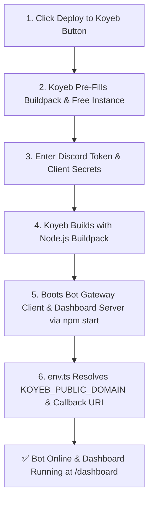

# Koyeb Free Nano Instance Deployment

Deploy HELIX Discord Bot to [Koyeb](https://www.koyeb.com/) on the **100% Free Nano Instance tier** using native Node.js runtime and declarative configuration (`koyeb.yaml`).

---

## ⚡ 1-Click Koyeb Deployment

[](https://app.koyeb.com/deploy?type=git&repository=github.com/HELIX-Origin/HELIX-Discord-Bot&branch=main&builder=buildpack&env[DISCORD_TOKEN]=&env[DISCORD_CLIENT_ID]=&env[DISCORD_CLIENT_SECRET]=&env[NEXTAUTH_SECRET]=&env[NODE_ENV]=production&ports=5000;http;/&instance_type=free)

Click the button above to launch an automated 1-click deployment on Koyeb.

- **Instance Type**: `free` (Eco Nano, 512 MB RAM, free SSL, continuous runtime)
- **Runtime**: Native Node.js Buildpack
- **Zero Sleep**: Unlike standard web sleep models, Koyeb free services stay active without sleeping.
- **Dynamic URLs**: App domain and Discord OAuth2 callback redirects are automatically detected from `KOYEB_PUBLIC_DOMAIN`.

---

## Deployment Architecture



---

## Required Environment Variables

| Config Var | Description | Required? | Source in Discord Developer Portal |
|---|---|---|---|
| `DISCORD_TOKEN` | Bot user token | **Yes** | **Bot** tab → *Reset Token* |
| `DISCORD_CLIENT_ID` | Application client ID | **Yes** | **General Information** → *Application ID* |
| `DISCORD_CLIENT_SECRET` | OAuth2 secret for Dashboard | **Yes** | **OAuth2** → **General** → *Client Secret* |
| `NEXTAUTH_SECRET` | 32+ character HMAC key | **Yes** | Generate with `openssl rand -base64 32` |
| `NODE_ENV` | Runtime environment | Set to `production` | Pre-configured |
| `PORT` | Listening port | Set to `5000` | Pre-configured |

---

## Discord OAuth2 Redirect URI Configuration

In the [Discord Developer Portal](https://discord.com/developers/applications):
1. Navigate to your Application → **OAuth2** → **Redirects**.
2. Add your Koyeb callback URL:
   ```
   https://<your-app-name>.koyeb.app/api/auth/callback/discord
   ```
3. Click **Save Changes**.

---

## Verification & Health Check

Koyeb monitors `GET /api/health` on port `5000` for live health checks.
- **Companion Dashboard**: `https://<your-app-name>.koyeb.app/dashboard`
- **Health Check Endpoint**: `https://<your-app-name>.koyeb.app/api/health`
