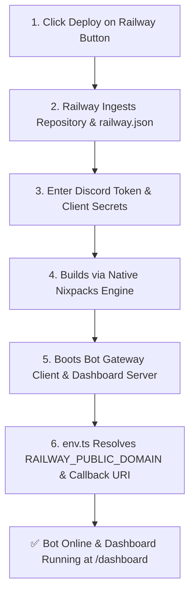

# Railway Deployment

Deploy HELIX Discord Bot to [Railway](https://railway.com/) using the native Node.js / Nixpacks engine and `railway.json` configuration.

---

## ⚡ 1-Click Railway Deployment

[](https://railway.com/template/github.com/HELIX-Origin/HELIX-Discord-Bot)

Click the button above to launch an automated 1-click deployment on Railway.

- **Builder**: Nixpacks (Native Node.js 22 LTS runtime)
- **Health Check**: Configured on `/api/health` with automatic restart policy
- **Dynamic URLs**: App domain and Discord OAuth2 callback redirects are automatically detected from `RAILWAY_PUBLIC_DOMAIN` and `RAILWAY_STATIC_URL`

---

## Deployment Architecture



---

## Required Environment Variables

When deploying on Railway, configure your Discord credentials in the Railway Dashboard Variables tab:

| Config Var | Description | Required? | Source in Discord Developer Portal |
|---|---|---|---|
| `DISCORD_TOKEN` | Bot user token | **Yes** | **Bot** tab → *Reset Token* |
| `DISCORD_CLIENT_ID` | Application client ID | **Yes** | **General Information** → *Application ID* |
| `DISCORD_CLIENT_SECRET` | OAuth2 secret for Dashboard | **Yes** | **OAuth2** → **General** → *Client Secret* |
| `NEXTAUTH_SECRET` | 32+ character HMAC key | **Yes** | Generate with `openssl rand -base64 32` |
| `NODE_ENV` | Runtime environment | Set to `production` | Pre-configured |
| `PORT` | Listening port | Defaults to `5000` | Auto-assigned by Railway |

---

## Discord OAuth2 Redirect URI Configuration

In the [Discord Developer Portal](https://discord.com/developers/applications):
1. Navigate to your Application → **OAuth2** → **Redirects**.
2. Add your Railway callback URL:
   ```
   https://<your-railway-domain>.up.railway.app/api/auth/callback/discord
   ```
3. Click **Save Changes**.

---

## Verification & Health Check

Railway probes `GET /api/health` on the allocated port for live health checks.
- **Companion Dashboard**: `https://<your-railway-domain>.up.railway.app/dashboard`
- **Health Check Endpoint**: `https://<your-railway-domain>.up.railway.app/api/health`
