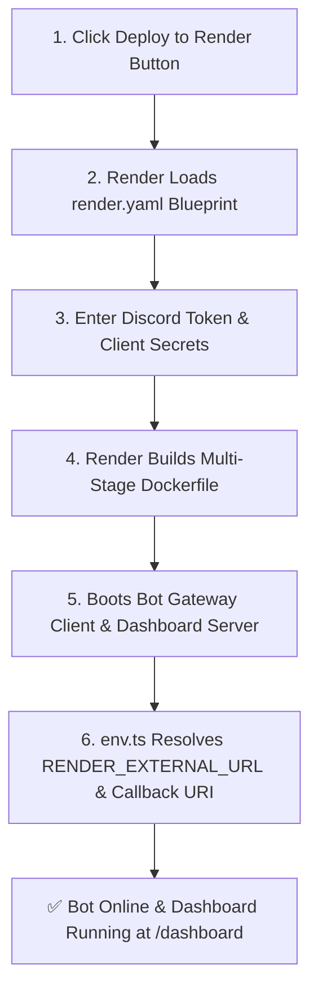

# Render Free Web Service Deployment

Deploy HELIX Discord Bot to [Render](https://render.com/) on the **100% Free Web Service tier** using the native Dockerfile and Blueprint configuration (`render.yaml`).

---

## ⚡ 1-Click Render Deployment

[](https://render.com/deploy?repo=https://github.com/HELIX-Origin/HELIX-Discord-Bot)

Click the button above to launch an automated 1-click deployment on Render.

- **Plan**: Free Web Service (512 MB RAM, free SSL certificate)
- **Secrets Auto-Generated**: `NEXTAUTH_SECRET` is automatically generated by Render.
- **Dynamic URLs**: App domain and Discord OAuth2 callback redirects are automatically detected from `RENDER_EXTERNAL_URL`.

---

## Deployment Architecture



---

## Required Environment Variables

When deploying via the Render Blueprint, configure your Discord credentials:

| Config Var | Description | Required? | Source in Discord Developer Portal |
|---|---|---|---|
| `DISCORD_TOKEN` | Bot user token | **Yes** | **Bot** tab → *Reset Token* |
| `DISCORD_CLIENT_ID` | Application client ID | **Yes** | **General Information** → *Application ID* |
| `DISCORD_CLIENT_SECRET` | OAuth2 secret for Dashboard | **Yes** | **OAuth2** → **General** → *Client Secret* |
| `NEXTAUTH_SECRET` | 32+ character HMAC key | **Auto** | Auto-generated by Render blueprint |
| `NODE_ENV` | Runtime environment | Set to `production` | Pre-configured in `render.yaml` |
| `PORT` | Listening port | Set to `5000` | Pre-configured in `render.yaml` |

---

## Discord OAuth2 Redirect URI Configuration

In the [Discord Developer Portal](https://discord.com/developers/applications):
1. Navigate to your Application → **OAuth2** → **Redirects**.
2. Add your Render callback URL:
   ```
   https://<your-service-name>.onrender.com/api/auth/callback/discord
   ```
3. Click **Save Changes**.

---

## Verification & Health Check

Render automatically probes `GET /api/health` every few seconds to ensure zero downtime.
- **Companion Dashboard**: `https://<your-service-name>.onrender.com/dashboard`
- **Health Check Endpoint**: `https://<your-service-name>.onrender.com/api/health`
