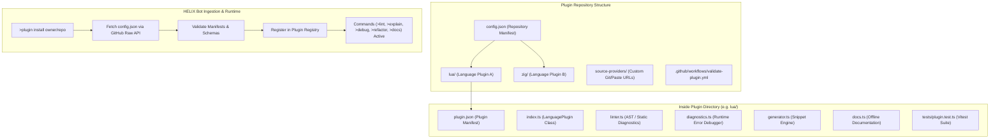

# Plugin Repository Structural Specification

This document defines the complete architectural and structural specification for creating and hosting HELIX language plugin repositories on GitHub.

> **Official Starter Template**: Fork or generate your repository from [HELIX-Origin/helix-plugin-template](https://github.com/HELIX-Origin/helix-plugin-template) to start with a fully-typed, pre-tested structure.



---

## 1. Directory Layout

A HELIX plugin repository can host a single language plugin or multiple related language plugins and source providers:

```
my-helix-plugins/
├── .github/
│   └── workflows/
│       └── validate-plugin.yml   # Automated GitHub Actions validation
├── config.json                   # Root repository manifest (Required)
├── package.json                  # TypeScript & testing dependencies
├── tsconfig.json                 # TypeScript compiler configuration
├── vitest.config.ts              # Vitest test configuration
├── README.md                     # Repository documentation & installation guide
├── LICENSE                       # Open-source license (e.g. MIT, BSD-3-Clause)
├── lua/                          # Plugin folder for Lua
│   ├── plugin.json               # Plugin manifest (Required)
│   ├── index.ts                  # Entry point exporting LanguagePlugin (Required)
│   ├── linter.ts                 # Static analysis & AST rule engine
│   ├── diagnostics.ts            # Error stack trace analysis & debug engine
│   ├── generator.ts              # Deterministic code snippet generator
│   ├── refactor.ts               # Code modernization & refactoring rules
│   ├── security.ts               # Vulnerability inspection & AST audit
│   ├── docs.ts                   # Offline documentation & syntax reference
│   └── tests/
│       └── lua-plugin.test.ts    # Vitest unit test suite
└── custom-paste/                 # (Optional) Custom SourceProvider plugin
    ├── plugin.json
    └── provider.ts
```

---

## 2. Root Repository Manifest (`config.json`)

The `config.json` file is located at the root of the repository. When a user runs `>plugin install owner/repo`, the HELIX bot fetches and parses this file first.

### Schema Specification

```json
{
  "$schema": "http://json-schema.org/draft-07/schema#",
  "title": "HelixPluginRepoConfig",
  "type": "object",
  "required": ["repository", "name", "version", "plugins"],
  "properties": {
    "repository": {
      "type": "string",
      "description": "GitHub repository in 'owner/repo' format"
    },
    "name": {
      "type": "string",
      "description": "Human-readable display name for this plugin collection"
    },
    "version": {
      "type": "string",
      "description": "Semantic version string (e.g. '1.0.0')"
    },
    "description": {
      "type": "string",
      "description": "Short summary of what these plugins provide"
    },
    "author": {
      "type": "string",
      "description": "Author, organization, or maintainer name"
    },
    "homepage": {
      "type": "string",
      "description": "Optional homepage or documentation URL"
    },
    "plugins": {
      "type": "array",
      "description": "List of language plugins included in this repository",
      "items": {
        "type": "object",
        "required": ["id", "path"],
        "properties": {
          "id": {
            "type": "string",
            "description": "Unique plugin identifier (matching plugin.json id)"
          },
          "path": {
            "type": "string",
            "description": "Relative path to plugin directory from repository root"
          }
        }
      }
    },
    "sourceProviders": {
      "type": "array",
      "description": "Optional custom SourceProviders registered by this repository",
      "items": {
        "type": "object",
        "required": ["id", "path"],
        "properties": {
          "id": { "type": "string" },
          "path": { "type": "string" }
        }
      }
    }
  }
}
```

### Example `config.json`

```json
{
  "repository": "helix-community/game-dev-plugins",
  "name": "HELIX Game Development Language Plugins",
  "version": "1.2.0",
  "description": "Lua, GDScript, and C# intelligence plugins for HELIX Discord bot",
  "author": "HELIX Community Team",
  "homepage": "https://github.com/helix-community/game-dev-plugins",
  "plugins": [
    {
      "id": "lua",
      "path": "./lua"
    },
    {
      "id": "gdscript",
      "path": "./gdscript"
    }
  ]
}
```

---

## 3. Plugin Manifest (`plugin.json`)

Each plugin folder contains a `plugin.json` describing the plugin's capabilities, supported file extensions, and main entry file.

### Schema Specification

```json
{
  "$schema": "http://json-schema.org/draft-07/schema#",
  "title": "HelixPluginManifest",
  "type": "object",
  "required": [
    "id",
    "name",
    "version",
    "description",
    "fileExtensions",
    "entry",
    "capabilities"
  ],
  "properties": {
    "id": {
      "type": "string",
      "description": "Unique plugin identifier in lowercase alphanumeric format (e.g. 'lua', 'zig', 'rust')"
    },
    "name": {
      "type": "string",
      "description": "Display name of the language (e.g. 'Lua', 'Zig', 'Rust')"
    },
    "version": {
      "type": "string",
      "description": "SemVer version string of this plugin"
    },
    "description": {
      "type": "string",
      "description": "Detailed description of linter rules and language intelligence"
    },
    "author": {
      "type": "string",
      "description": "Plugin author name or handle"
    },
    "fileExtensions": {
      "type": "array",
      "items": { "type": "string" },
      "description": "List of file extensions handled by this plugin (e.g. ['.lua', '.luau'])"
    },
    "entry": {
      "type": "string",
      "description": "Relative path to entry point file (usually 'index.ts')"
    },
    "docUrl": {
      "type": "string",
      "description": "Official language documentation website"
    },
    "capabilities": {
      "type": "array",
      "items": {
        "type": "string",
        "enum": [
          "lint",
          "explain",
          "docs",
          "debug",
          "generate",
          "refactor",
          "inspect",
          "fixes",
          "format",
          "patterns"
        ]
      },
      "description": "List of capabilities implemented by this plugin"
    },
    "dependencies": {
      "type": "array",
      "items": { "type": "string" },
      "description": "Other plugin IDs required by this plugin (if any)"
    },
    "repository": {
      "type": "string",
      "description": "GitHub repository URL"
    }
  }
}
```

### Example `lua/plugin.json`

```json
{
  "id": "lua",
  "name": "Lua",
  "version": "1.0.0",
  "description": "Lua 5.4 static analysis, runtime debugging, and snippet generation",
  "author": "JaneDoe",
  "fileExtensions": [".lua", ".luau"],
  "entry": "index.ts",
  "docUrl": "https://www.lua.org/manual/5.4/",
  "capabilities": [
    "lint",
    "explain",
    "docs",
    "debug",
    "generate",
    "refactor",
    "inspect"
  ],
  "dependencies": [],
  "repository": "https://github.com/helix-community/game-dev-plugins"
}
```

---

## 4. Capability Matrix & Interface Contracts

Every capability declared in `plugin.json` corresponds to a method on the `LanguagePlugin` class exported by `index.ts`:

| Capability | Associated Command | Method Signature | Purpose |
|---|---|---|---|
| `lint` | `>lint` | `lint(code, fileName?): Promise<LintOutput>` | Static analysis, syntax error diagnostics, style violations |
| `explain` | `>explain` | `explain(code): Promise<ExplainOutput>` | Code structure analysis, concepts, and complexity rating |
| `docs` | `>docs <topic>` | `getDocumentation(topic): Promise<DocReference[]>` | Offline documentation lookup with official links and syntax examples |
| `debug` | `>debug` | `debug(errorLog, codeContext?): Promise<DebugDiagnostic>` | Stack trace analysis, root cause diagnosis, and fix suggestions |
| `generate` | `>generate <type> <name>` | `generate(type, name, options?): Promise<SnippetGeneration>` | Deterministic boilerplate and module code generation |
| `refactor` | `>refactor` | `refactor(code, rule?): Promise<RefactorOutput>` | Idiomatic code transformations and modernization |
| `inspect` | `>inspect` | `inspect(code): Promise<SecurityAuditResult>` | Security vulnerability audits and code safety rating |
| `fixes` | Auto-fix suggestion | `suggestFixes(errors): Promise<CodeFix[]>` | Automated code fixes for detected lint violations |
| `format` | Code formatter | `format(code): Promise<string>` | Code beautification and indentation |
| `patterns` | Architecture guides | `getPatterns(): Promise<CodePattern[]>` | Standard design patterns and architectural recipes |

---

## 5. TypeScript Contract Definitions (`types.ts`)

Plugin authors can copy this standard `types.ts` into their repository:

```typescript
export type PluginCapability =
  | 'lint'
  | 'explain'
  | 'fixes'
  | 'docs'
  | 'format'
  | 'patterns'
  | 'debug'
  | 'generate'
  | 'refactor'
  | 'inspect';

export interface LintResult {
  line: number;
  column?: number;
  message: string;
  severity: 'error' | 'warning' | 'info';
  rule?: string;
}

export interface LintOutput {
  fileName: string;
  language: string;
  results: LintResult[];
  errorCount: number;
  warningCount: number;
  durationMs?: number;
}

export interface ExplainSection {
  title: string;
  description: string;
}

export interface ExplainOutput {
  summary: string;
  concepts: string[];
  complexity?: 'Low' | 'Medium' | 'High';
  sections?: ExplainSection[];
}

export interface DocReference {
  title: string;
  url: string;
  summary: string;
  syntax?: string;
}

export interface DebugDiagnostic {
  errorType: string;
  summary: string;
  cause: string;
  fixes: string[];
  codeSample?: string;
}

export interface SnippetGeneration {
  fileName: string;
  description: string;
  code: string;
}

export interface RefactorOutput {
  description: string;
  changes: string[];
  refactoredCode: string;
}

export interface SecurityIssue {
  severity: 'low' | 'medium' | 'high' | 'critical';
  description: string;
  recommendation: string;
  line?: number;
}

export interface SecurityAuditResult {
  score: number;
  issues: SecurityIssue[];
  passed: boolean;
}

export interface SourceProviderResolution {
  rawFetchUrl: string;
  origin: string;
  label: string;
  detectedLanguage?: string;
}

export interface SourceProvider {
  id: string;
  name: string;
  domains: string[];
  canHandle(url: URL): boolean;
  resolve(url: URL): SourceProviderResolution;
}

export interface LanguagePlugin {
  id: string;
  name: string;
  version: string;
  fileExtensions: string[];
  capabilities: PluginCapability[];

  lint(code: string, fileName?: string): Promise<LintOutput> | LintOutput;
  explain(code: string): Promise<ExplainOutput> | ExplainOutput;
  getDocumentation(topic: string): Promise<DocReference[]> | DocReference[];

  debug?(errorLog: string, codeContext?: string): Promise<DebugDiagnostic> | DebugDiagnostic;
  generate?(type: string, name: string, options?: Record<string, any>): Promise<SnippetGeneration> | SnippetGeneration;
  refactor?(code: string, rule?: string): Promise<RefactorOutput> | RefactorOutput;
  inspect?(code: string): Promise<SecurityAuditResult> | SecurityAuditResult;
  suggestFixes?(errors: LintResult[]): Promise<any[]> | any[];
  format?(code: string): Promise<string> | string;
}
```

---

## 6. Automated GitHub Actions CI Workflow

Include `.github/workflows/validate-plugin.yml` in your plugin repository to automatically test and validate your manifests and TypeScript code on every push or pull request:

```yaml
name: Validate Plugins

on:
  push:
    branches: [main]
  pull_request:
    branches: [main]

jobs:
  validate:
    runs-on: ubuntu-latest

    steps:
      - name: Checkout repository
        uses: actions/checkout@v4

      - name: Setup Node.js 22
        uses: actions/setup-node@v4
        with:
          node-version: 22

      - name: Install dependencies
        run: npm ci

      - name: Typecheck TypeScript
        run: npx tsc --noEmit

      - name: Run Vitest Unit Tests
        run: npx vitest run
```

---

## 7. Installing and Updating Plugins in Discord

Once your repository is pushed to GitHub:

```bash
# Install a plugin repository
>plugin install username/my-helix-plugins

# List all active plugins
>plugin list

# Inspect details of an installed plugin
>plugin info lua

# Check for updates from GitHub
>plugin update
```
