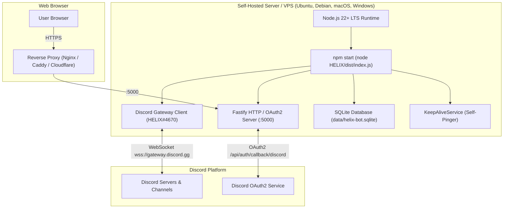

# Self-Hosting & Deployment Guide

HELIX is engineered as a zero-dependency, self-contained TypeScript application running natively on **Node.js 22+ LTS**. It combines a real-time Discord bot gateway client with a companion Fastify HTTP server and web dashboard.

---

## Architecture Overview



---

## Prerequisites

- **Node.js 22+ LTS**: [Download Node.js](https://nodejs.org/) (`node -v` should report `>= 22.0.0`).
- **npm 10+**: Included with Node.js.
- **Discord Developer Application**: Created on the [Discord Developer Portal](https://discord.com/developers/applications).
- **Domain Name & Reverse Proxy** *(Optional, for public dashboard access)*: Nginx, Caddy, or Cloudflare Tunnel with SSL/TLS.

---

## 1. Discord Developer Portal Setup

1. Go to [Discord Developer Portal](https://discord.com/developers/applications) and create a **New Application**.
2. **Bot Tab**:
   - Click **Add Bot**.
   - Under **Privileged Gateway Intents**, enable **Message Content Intent** (required for prefix commands like `>help`, `>ticket`, `>scaffold`).
   - Click **Reset Token**, copy the token, and save it as `DISCORD_TOKEN`.
3. **General Information Tab**:
   - Copy the **Application ID** and save it as `DISCORD_CLIENT_ID`.
4. **OAuth2 Tab**:
   - Under **General**, click **Reset Secret**, copy it, and save it as `DISCORD_CLIENT_SECRET`.
   - Under **Redirects**, add the following callback URLs:
     - For local development:
       ```
       http://localhost:5000/api/auth/callback/discord
       ```
     - For public production domain (if hosting publicly):
       ```
       https://your-domain.com/api/auth/callback/discord
       ```
   - Click **Save Changes**.

---

## 2. Installation & Build

Clone the repository and install all dependencies:

```bash
# Clone the repository
git clone https://github.com/HELIX-Origin/HELIX-Discord-Bot.git
cd HELIX-Discord-Bot

# Install dependencies for workspace and bot package
npm ci
npm --prefix HELIX ci

# Compile TypeScript source to dist/
npm run build
```

---

## 3. Environment Configuration (`.env`)

Create a `.env` file in the root directory:

```ini
# ==============================================================================
# DISCORD CREDENTIALS (Required)
# ==============================================================================
DISCORD_TOKEN=your_bot_token_here
DISCORD_CLIENT_ID=your_application_id_here
DISCORD_CLIENT_SECRET=your_oauth2_client_secret_here

# ==============================================================================
# WEB DASHBOARD & AUTHENTICATION (Required for Dashboard)
# ==============================================================================
# Generate a 32+ character key: openssl rand -base64 32
NEXTAUTH_SECRET=your_random_32_character_secret_here

# Optional: Public URL for dashboard access and OAuth2 redirects (e.g. https://bot.yourdomain.com)
# If omitted, defaults to http://localhost:5000
NEXTAUTH_URL=

# Optional: Internal loopback URL for server-side NextAuth self-requests
# Defaults to http://localhost:5000
NEXTAUTH_INTERNAL_URL=http://localhost:5000

# ==============================================================================
# SERVER CONFIGURATION
# ==============================================================================
PORT=5000
NODE_ENV=production

# ==============================================================================
# AUTONOMOUS KEEP-ALIVE (Optional)
# ==============================================================================
# Set to 'true' to ping /api/health periodically, or 'false' to disable
HELIX_SELF_PING=true
HELIX_SELF_PING_INTERVAL_MS=600000
```

---

## 4. Running the Bot

HELIX includes native cross-platform starter scripts located in the `HELIX/` bot directory. Each script supports running with an interactive console window or silently in the background:

| Platform | Interactive Console | Silent Background Runner |
| :--- | :--- | :--- |
| **🪟 Windows** | Double-click `run-start.bat` or `run-dev.bat` | `wscript.exe silent.vbs run-start.bat` |
| **🐧 Linux** | `./run-start.sh` or `./run-dev.sh` | `./run-start.sh --silent` |
| **🍏 macOS** | Double-click `run-start.command` or `run.command` | `./run-start.command --silent` |

### Command-Line Execution
```bash
# Development Mode (with hot-reload)
npm run dev

# Production Mode
npm start
```

When started successfully, the console output will display:
```
====================================================
  🤖 HELIX Discord Bot & Web Dashboard
====================================================

[INFO] Language Plugin System initialized: 4 plugin(s) active.
[INFO] Server listening at http://0.0.0.0:5000
[INFO] Discord credentials loaded: Token=MTU0NT...**** (72 chars), ClientID=1545203514932731934
[INFO] Connecting Discord Bot client to gateway...
[SUCCESS] Discord Bot connected to gateway as HELIX#4670.
[INFO] Companion dashboard online: http://localhost:5000/dashboard
```

---

## 5. OS-Specific Self-Hosting Guides

---

### 🐧 Linux (Ubuntu, Debian, RHEL, Arch)

Linux is the recommended production OS for 24/7 self-hosting.

#### Step 1: Install Node.js 22 LTS
```bash
# Ubuntu / Debian via NodeSource
curl -fsSL https://deb.nodesource.com/setup_22.x | sudo -E bash -
sudo apt-get install -y nodejs git build-essential

# Verify
node -v && npm -v
```

#### Step 2: Launching the Bot

**Option A: Interactive Terminal Window**
```bash
cd HELIX
chmod +x run-start.sh run-dev.sh
./run-start.sh
```

**Option B: Silent Background Execution**
```bash
cd HELIX
./run-start.sh --silent
# Live logs stream to helix.log
```

**Option C: systemd 24/7 Background Service (Production Recommended)**
Create `/etc/systemd/system/helix-bot.service`:
```ini
[Unit]
Description=HELIX Discord Bot & Dashboard
After=network.target

[Service]
Type=simple
User=ubuntu
WorkingDirectory=/opt/helix-bot/HELIX
ExecStart=/usr/bin/npm start
Restart=always
RestartSec=10
EnvironmentFile=/opt/helix-bot/.env
StandardOutput=syslog
StandardError=syslog
SyslogIdentifier=helix-bot

[Install]
WantedBy=multi-user.target
```

Enable and start the service:
```bash
sudo systemctl daemon-reload
sudo systemctl enable helix-bot
sudo systemctl start helix-bot
sudo systemctl status helix-bot
```

#### Step 3: Configure UFW Firewall
```bash
sudo ufw allow 80/tcp
sudo ufw allow 443/tcp
sudo ufw allow 5000/tcp # (If accessing directly without reverse proxy)
```

---

### 🪟 Windows (Windows 10, 11, Windows Server 2022)

You can run HELIX natively on Windows using PowerShell, Command Prompt, or double-clickable scripts.

#### Step 1: Install Node.js 22 LTS
1. Download the Windows Installer (.msi) from [nodejs.org](https://nodejs.org/) or install via NVM for Windows (`nvm install 22 && nvm use 22`).
2. Verify installation in PowerShell:
   ```powershell
   node -v
   npm -v
   ```

#### Step 2: Allow Port in Windows Defender Firewall (Optional)
To allow inbound dashboard connections over your local network or public IP:
```powershell
New-NetFirewallRule -DisplayName "HELIX Bot Dashboard" -Direction Inbound -LocalPort 5000 -Protocol TCP -Action Allow
```

#### Step 3: Launching with Console Window
Double-click `run-start.bat` (production) or `run-dev.bat` (development with TypeScript hot-reloading) inside the `HELIX` folder. A dedicated console window will open displaying live logs, runtime metrics, and error diagnostics.

Alternatively, run from PowerShell:
```powershell
# Development mode with hot-reload
npm run dev

# Production mode
npm start
```

#### Step 4: Silent Background Execution (No Console Window)
To run HELIX in the background without keeping any console window open, use the included `silent.vbs` VBScript runner:
```cmd
# Start production bot silently in the background
wscript.exe silent.vbs run-start.bat

# Start development mode silently in the background
wscript.exe silent.vbs run-dev.bat
```

To stop a background Node.js bot process on Windows:
```powershell
Stop-Process -Name "node" -Force
```

---

### 🍏 macOS (Ventura, Sonoma, Sequoia)

#### Step 1: Install Node.js via Homebrew
```bash
# Install Homebrew if not installed
/bin/bash -c "$(curl -fsSL https://raw.githubusercontent.com/Homebrew/install/HEAD/install.sh)"

# Install Node.js 22 LTS
brew install node@22 git
brew link --overwrite --force node@22
node -v
```

#### Step 2: Launching the Bot

**Option A: Interactive macOS Terminal Window**
Double-click `run-start.command` (production) or `run-dev.command` (development) in Finder, or run from Terminal:
```bash
cd HELIX
chmod +x run-start.command run-dev.command run.command
./run-start.command
```

**Option B: Silent Background Execution**
```bash
cd HELIX
./run-start.command --silent
# Live logs stream to helix.log
```

**Option C: 24/7 Background Service via `launchd`**
Determine your system npm path with `which npm` (typically `/opt/homebrew/bin/npm` on Apple Silicon or `/usr/local/bin/npm` on Intel).

Create `~/Library/LaunchAgents/com.helix.bot.plist`:
```xml
<?xml version="1.0" encoding="UTF-8"?>
<!DOCTYPE plist PUBLIC "-//Apple//DTD PLIST 1.0//EN" "http://www.apple.com/DTDs/PropertyList-1.0.dtd">
<plist version="1.0">
<dict>
    <key>Label</key>
    <string>com.helix.bot</string>
    <key>ProgramArguments</key>
    <array>
        <!-- Replace with output of 'which npm' -->
        <string>/opt/homebrew/bin/npm</string>
        <string>start</string>
    </array>
    <key>WorkingDirectory</key>
    <!-- Replace with output of 'pwd' -->
    <string>/Users/yourusername/HELIX-Discord-Bot/HELIX</string>
    <key>RunAtLoad</key>
    <true/>
    <key>KeepAlive</key>
    <true/>
    <key>StandardOutPath</key>
    <string>/Users/yourusername/HELIX-Discord-Bot/data/bot.log</string>
    <key>StandardErrorPath</key>
    <string>/Users/yourusername/HELIX-Discord-Bot/data/bot-err.log</string>
</dict>
</plist>
```

Load and start the daemon:
```bash
launchctl load ~/Library/LaunchAgents/com.helix.bot.plist
launchctl start com.helix.bot
```

---

### ☁️ Cloud Platforms (Render, Koyeb, Railway, Heroku, Cloud VPS)

If you choose to host HELIX on cloud platforms or container-free PaaS web services:

#### Requirements for Cloud Platforms:
1. **Static Domain**: You must specify your assigned or custom static domain in `NEXTAUTH_URL` (e.g. `https://your-app.onrender.com` or `https://bot.yourdomain.com`).
2. **Discord OAuth2 Redirect**: Add `https://your-app.onrender.com/api/auth/callback/discord` to **Discord Developer Portal → Application → OAuth2 → Redirects**.
3. **Autonomous Keep-Alive (Self-Pinger)**:
   - Free cloud tiers (such as Render Free Web Services) automatically spin down after 15 minutes of inbound HTTP inactivity, which disconnects the Discord Gateway.
   - Set `HELIX_SELF_PING=true` in your platform's environment variables.
   - HELIX will automatically ping its own `/api/health` endpoint every 10 minutes (`600000` ms), keeping the cloud instance awake 24/7 without requiring external cron services.

#### Recommended Cloud Platform Settings:
- **Runtime**: Node.js 22 LTS
- **Build Command**: `npm ci --include=dev && npm --prefix HELIX ci --include=dev && npm run build`
- **Start Command**: `npm start`
- **Health Check Path**: `/api/health`
- **Environment Variables**:
  ```ini
  DISCORD_TOKEN=your_token
  DISCORD_CLIENT_ID=your_client_id
  DISCORD_CLIENT_SECRET=your_client_secret
  NEXTAUTH_SECRET=your_32_char_secret
  NEXTAUTH_URL=https://your-app.onrender.com
  NODE_ENV=production
  PORT=5000
  HELIX_SELF_PING=true
  HELIX_SELF_PING_INTERVAL_MS=600000
  ```

---

## 6. Reverse Proxy Setup (HTTPS / SSL)

### Nginx Configuration

```nginx
server {
    server_name bot.yourdomain.com;

    location / {
        proxy_pass http://127.0.0.1:5000;
        proxy_http_version 1.1;
        proxy_set_header Upgrade $http_upgrade;
        proxy_set_header Connection "upgrade";
        proxy_set_header Host $host;
        proxy_set_header X-Real-IP $remote_addr;
        proxy_set_header X-Forwarded-For $proxy_add_x_forwarded_for;
        proxy_set_header X-Forwarded-Proto $scheme;
    }

    listen 80;
}
```

Obtain a free Let's Encrypt SSL certificate:
```bash
sudo certbot --nginx -d bot.yourdomain.com
```

### Caddy Configuration

```caddy
bot.yourdomain.com {
    reverse_proxy 127.0.0.1:5000
}
```

---

## 7. Verification & Health Checks

- **Health Check Endpoint**: `GET /api/health` returns `200 OK` with JSON health telemetry (uptime, database status, gateway status, and keep-alive ping count).
- **Companion Dashboard**: `GET /dashboard` provides the interactive web configuration portal.
- **Administrator Invite**: Use the invite URL displayed in the dashboard header or console to add HELIX to your server.
