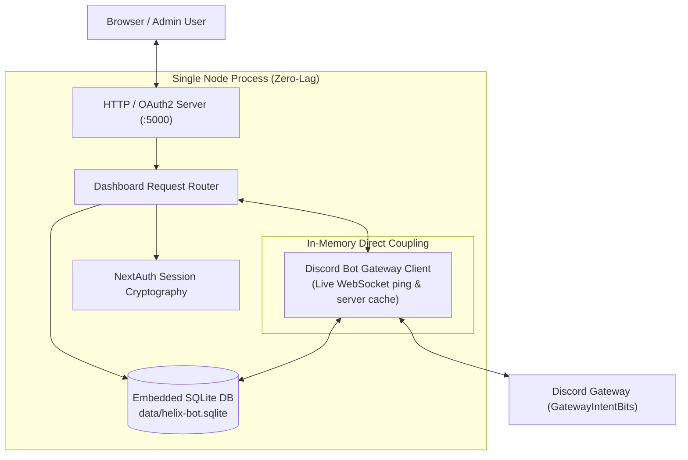

# NextAuth Web Dashboard & Direct Bot Connection

The Web Dashboard runs directly alongside the bot process, providing a rich graphical interface with zero latency.

---

## 1. Zero-Lag In-Process Connection

Unlike standard microservice setups where the dashboard queries the bot over HTTP or Redis, HELIX couples the web dashboard and bot client directly in memory:
- **Bot Gateway Ping**: Reads directly from `HelixBotClient.getInstance().getGatewayLatency()` (live WebSocket ping).
- **SQLite Database**: Local sync engine with 0ms network latency.
- **Direct Broadcast**: Dispatches channel announcements immediately via `botClient.sendChannelMessage()`.
- **Live Server Cache**: Guild names, channels, and member counts are served directly from the Discord gateway cache.

---

## 2. NextAuth Configuration

- `NEXTAUTH_URL`: Canonical public URL (e.g. `http://localhost:5000` or `https://my-helix-bot.herokuapp.com`).
- `NEXTAUTH_INTERNAL_URL`: Internal loopback URL used by backend connections. Defaults to `http://localhost`; the dashboard automatically resolves and attaches the bot's active listener port (e.g. `5000` or `$PORT`) to prevent port conflicts, so no port needs to be manually entered in `.env`.
- `NEXTAUTH_SECRET`: HMAC SHA-256 signing secret for token encryption.

---

## 3. Dashboard Endpoints

- `GET /dashboard`: Responsive dark-themed dashboard UI.
- `GET /api/dashboard/stats`: Returns live gateway ping, connected guilds, recent query stream, and SQLite metrics.
- `POST /api/dashboard/bot/broadcast`: Sends instant message to specified Discord channel ID.
- `POST /api/dashboard/ai`: Queries Google Antigravity, GitHub Copilot, or Open Code directly.
- `POST /api/dashboard/scaffold`: Triggers multi-framework scaffolding studio.
- `GET /api/dashboard/guilds`: Renders live server rosters and active user sessions.
