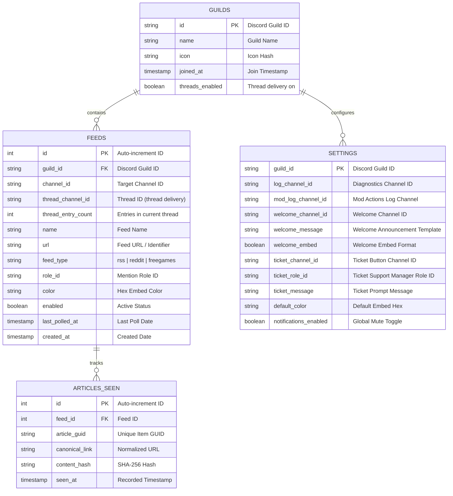

# 🏗️ Architecture & System Design

HELIX Discord Bot is engineered as a modular, asynchronous TypeScript (ESM) application combining a background polling daemon, a native Node.js HTTP dashboard & REST API, and a Discord bot client connected over the official Gateway WebSocket and REST API.

---

## 📐 System Architecture Overview

```mermaid
flowchart TB
    subgraph ClientLayer["Client & Interface Layer"]
        Dashboard["Glassmorphism Web Dashboard (HTML5 / Vanilla CSS / JS)"]
        DiscordApp["Discord Mobile / Desktop Client"]
    end

    subgraph AppLayer["Application Core (Node.js / TypeScript)"]
        HttpServer["Native HTTP Server & REST API (`src/dashboard/routes/*`)"]
        SessionMgr["Discord OAuth2 & Session Manager (`src/dashboard/oauth/*` + `src/dashboard/auth/*`)"]
        BotClient["Native Discord Bot Client (`src/bot/*`)"]
        FeedWatcher["Background Feed Watcher (`src/feed/watcher.ts`)"]
        ParserEngine["Multi-Format Parser & Scrapers (`src/feed/*`)"]
        DedupEngine["Deduplication & Canonical Normalizer (`src/feed/deduplication.ts`)"]
    end

    subgraph DataLayer["Persistence & State Layer"]
        DB[(SQLite Database (node:sqlite, WAL))]
        Cache[(In-Memory AppState Cache)]
    end

    subgraph ExternalServices["External Endpoints"]
        DiscordAPI["Discord REST API (v10) & Gateway"]
        RemoteFeeds["RSS / Atom / Subreddits / Game APIs"]
    end

    Dashboard <--> HttpServer
    HttpServer <--> SessionMgr
    SessionMgr <--> DiscordAPI
    HttpServer <--> DB

    DiscordApp <--> DiscordAPI
    DiscordAPI <--> BotClient
    BotClient <--> DB

    FeedWatcher --> ParserEngine
    ParserEngine <--> RemoteFeeds
    ParserEngine --> DedupEngine
    DedupEngine <--> DB
    DedupEngine <--> Cache
    DedupEngine --> BotClient
    BotClient --> DiscordAPI
```

---

## 🧩 Core Components Breakdown

### 1. Web Dashboard & API (`src/dashboard/`)
- Built with **native Node.js `http`** and a zero-dependency router, serving a responsive, zero-frontend-dependency Vanilla CSS & JavaScript UI.
- **Modular View Components**: Deconstructed into domain-focused view modules in `src/dashboard/views/dashboard/` (`sidebar.ts`, `overview.ts`, `feeds.ts`, `sources.ts`, `welcome.ts`, `tickets.ts`, `logs.ts`, `guildadmin.ts`, `settings.ts`, `styles.ts`, `clientScript.ts`).
- **Responsive Layout & Live Discord Previews**: Management views (e.g. Welcome and Tickets) feature a responsive 2-column grid (`repeat(auto-fit, minmax(360px, 1fr))`) that pairs settings with simulated live Discord preview cards rendering markdown and interactive components in real time.
- **Discord-Style Categorized Navigation**: Section-grouped sidebar navigation (**General**, **Feeds & Alerts**, **System**) with an active server switcher banner.
- **Theme System**: Env-driven themes (`glassmorphism`, `dark`, `light`, `cyberpunk`, `dracula`, `nord`, `emerald`), each defining its own accent color palette via canonical theme files (`src/dashboard/views/themes/*.ts`) served through `getThemeCss()`, plus a toggleable landing page.
- **REST Endpoints**: CRUD operations for feeds, guild channel inspection, role listing, and activity logs (Developer Tools).

### 2. Background Feed Watcher (`src/feed/watcher.ts`)
- Operates on a continuous polling loop with near-real-time cadence (default 1 minute, configurable via `POLL_INTERVAL_MS` or 1, 10, 30, 60 minutes) persisted in SQLite.
- **Real-Time Single-Newest-Post Delivery**: Delivers strictly the single newest post per polling cycle and drains the older backlog as sent, eliminating burst dumps and shielding channels from Discord rate limits.
- Runs balanced asynchronous worker pools.
- Features weekly/daily schedulers for Free Games promotions.
- **Thread Delivery**: routes entries through `FeedThreadManager` (`src/feed/threads.ts`), auto-creating/rotating a dedicated thread per feed in the feed's own delivery channel for thread-enabled guilds, with a keepalive pass (`THREAD_KEEPALIVE_*`) scheduled alongside the watcher loop.

### 3. Parser & Scrapers Engine (`src/feed/`)
- Unified parser handling XML (RSS/Atom), JSON Feed, Reddit (with community home post filtering), and Free Games storefronts.
- Sanitizes malformed XML, extracts CDATA payloads, resolves relative links, and cleans HTML tags for Discord embed descriptions.

### 4. Persistence Layer (`src/db/`)
- **SQLite** via Node's native `node:sqlite` driver (WAL mode) — the only supported database engine.
- Schema includes `users`, `sessions`, `oauth_connections`, `feeds`, `sent_entries`, `settings`, `activity_log`, and `discord_guilds`.

---

## 💾 Database Schema Reference


