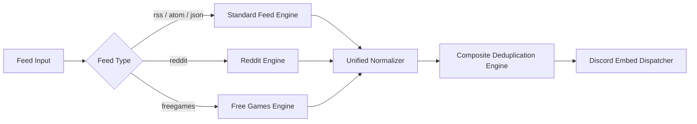

# 📡 Feeds & Web Scrapers Engine

HELIX Discord Bot features a high-throughput, fault-tolerant feed processing engine capable of ingesting traditional syndication formats, Reddit, and free games giveaways.

---

## 🌐 Supported Feed Protocols & Types

### 1. Standard Syndication (RSS / Atom / JSON Feed)
- **RSS 0.91, 0.92, 1.0 (RDF), and 2.0**
- **Atom 1.0 & 0.3**
- **JSON Feed 1.0 & 1.1**
- **Features**: Automatic encoding detection, gzip/deflate compression handling, malformed XML sanitization, CDATA extraction, and HTML tag stripping for clean embed previews.

### 2. Reddit Feeds & Pure Image Mode
- Native subreddit scraping supporting `/r/subreddit`, sort orders (`hot`, `new`, `top`), and multi-reddits (`/r/subreddit1+subreddit2`).
- Supports **Pure Image Mode** (`feedType: 'reddit'`) and **Standard RSS Mode** (`feedType: 'rss'`).
- See [Reddit Feeds Documentation](Reddit-Feeds.md) for full details.

### 3. Free Games & Giveaways Aggregator
- Multi-storefront engine supporting Epic Games, Steam, GOG, Humble Bundle, IndieGala, Itch.io, Ubisoft, EA App, Prime Gaming, and Battle.net.
- Automated daily polling with deduplication.
- See [Free Games Documentation](Free-Games-Feeds.md) for full details.

---

## 🔍 Composite Deduplication Engine

To eliminate duplicated notifications across server restarts, feed updates, or modified publishing dates, HELIX Discord Bot uses a 3-tier composite deduplication strategy:

1. **Primary Key Check (`GUID / ID`)**: Checks unique item identifiers provided by the feed creator.
2. **Canonical Link Normalization**: Strips tracking parameters (`utm_source`, `utm_medium`, `fbclid`, etc.) to produce a normalized URL identifier.
3. **Content Signature Hash**: If GUID and Link are missing or mutable, a SHA-256 hash is computed over `Title + Normalized Content + Timestamp`.

---

## ⚡ Performance, Caching & Concurrency

- **Conditional HTTP GET**: Uses `If-None-Match` (ETag) and `If-Modified-Since` headers to prevent downloading uncompressed payloads if the remote feed has not changed (returns `304 Not Modified`).
- **Concurrent Worker Pools**: Feeds are polled in balanced asynchronous batches with configurable concurrency, preventing I/O starvation.
- **Custom User-Agent Engine**: Sends compliant User-Agent headers with contact info to prevent bot blocks from Cloudflare or Akamai edge nodes.
