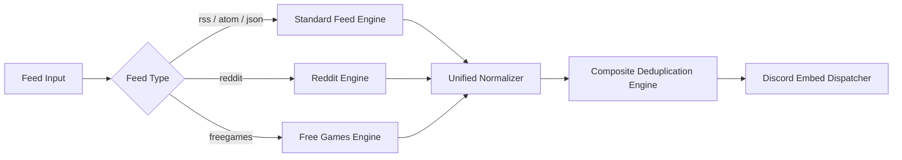

# 📡 Feeds & Web Scrapers Engine

HELIX Discord Bot features a high-throughput, fault-tolerant feed processing engine capable of ingesting traditional syndication formats, Reddit, and free games giveaways.

---

## 🌐 Supported Feed Protocols & Types

### 1. Standard Syndication (RSS / Atom / JSON Feed)
- **RSS 0.91, 0.92, 1.0 (RDF), and 2.0**
- **Atom 1.0 & 0.3**
- **JSON Feed 1.0 & 1.1**
- **Features**: Automatic encoding detection, gzip/deflate compression handling, malformed XML sanitization, CDATA extraction, and HTML tag stripping for clean embed previews.

### 2. Reddit Feeds & Pure Image Mode
- Native subreddit scraping supporting `/r/subreddit`, sort orders (`hot`, `new`, `top`), and multi-reddits (`/r/subreddit1+subreddit2`).
- Supports **Pure Image Mode** (`feedType: 'reddit'`) and **Standard RSS Mode** (`feedType: 'rss'`).
- See [Reddit Feeds Documentation](Reddit-Feeds) for full details.

### 3. Free Games & Giveaways Aggregator
- Multi-storefront engine supporting Epic Games, Steam, GOG, Humble Bundle, IndieGala, Itch.io, Ubisoft, EA App, Prime Gaming, and Battle.net.
- Automated daily polling with deduplication.
- See [Free Games Documentation](Free-Games-Feeds) for full details.

---

## 📊 Subscription Limits (Per Dashboard Tab)

Each dashboard **tab** maps to a feed category. Feeds are counted per category, per server user.

| Tab (category) | Feed types | Default max feeds |
| :--- | :--- | :--- |
| **News & RSS** | `rss`, `scrape` | **10** |
| **Reddit** | `reddit` | **10** |
| **Free Games** | `free_games` (all stores) | Unlimited |
| **Stream Alerts** | `youtube`, `twitch` | Unlimited |

Hosts can customize the caps with the `FEED_CATEGORY_LIMITS` environment variable (a CSV of `category=number` pairs, e.g. `rss=15,reddit=20`). Setting a category to `0` removes the cap for that tab. See [wiki/Configuration](Configuration).

Attempting to exceed a limit returns a clear `Subscription limit reached` error in the dashboard and via the slash commands.

---

## ⏱️ Delivery Cadence

- **RSS / Atom / Scrape feeds**: published **once per day, one post per source** (a 6-hour minimum floor also applies). Pending posts stay queued and are delivered by the next eligible polling window.
- **Reddit feeds**: follow the dashboard's configurable 10–60 minute interval.
- **Free Games**: polled **daily**, delivering only new giveaways.
- **Stream Alerts (YouTube / Twitch)**: delivered immediately on live/upload events via webhooks (periodic polling as fallback).

---

## 🔍 Composite Deduplication Engine

To eliminate duplicated notifications across server restarts, feed updates, or modified publishing dates, HELIX Discord Bot uses a 3-tier composite deduplication strategy:

1. **Primary Key Check (`GUID / ID`)**: Checks unique item identifiers provided by the feed creator.
2. **Canonical Link Normalization**: Strips tracking parameters (`utm_source`, `utm_medium`, `fbclid`, etc.) to produce a normalized URL identifier.
3. **Content Signature Hash**: If GUID and Link are missing or mutable, a SHA-256 hash is computed over `Title + Normalized Content + Timestamp`.

---

## ⚡ Performance, Caching & Concurrency

- **Conditional HTTP GET**: Uses `If-None-Match` (ETag) and `If-Modified-Since` headers to prevent downloading uncompressed payloads if the remote feed has not changed (returns `304 Not Modified`).
- **Concurrent Worker Pools**: Feeds are polled in balanced asynchronous batches with configurable concurrency, preventing I/O starvation.
- **Custom User-Agent Engine**: Sends compliant User-Agent headers with contact info to prevent bot blocks from Cloudflare or Akamai edge nodes.

---

## ⚡ Manual Polling & Immediate Triggers

While all feeds and alerts poll automatically according to background schedules, immediate checks can be triggered on demand without waiting for scheduled intervals:

### 1. Dashboard UI Triggers
- **Server Overview**: Click **Check Feeds & Alerts Now** at the top of the Overview tab to poll all active feeds and alerts for the selected guild.
- **Category Tabs**: Click **Check All Now** on the **News & RSS Feeds**, **Reddit Streams**, **Free Games Drops**, or **Stream Alerts** tabs to poll that specific category.
- **Individual Feeds**: Click the ⚡ (**Check Now**) icon next to any feed in the feed list or within the feed edit modal.

### 2. Discord Slash Commands
- `/rss poll [id]` — Immediately poll a specific RSS/scraper feed or all RSS feeds in the server.
- `/free-games check` — Immediately check for new game giveaways and free store drops.
- `/youtube check [id]` — Immediately check for new uploads or livestreams.
- `/twitch check [id]` — Immediately check live stream status for Twitch streamers.
- `/reddit poll [id]` — Immediately poll a specific subreddit feed or all Reddit feeds in the server.

### 3. REST API Endpoints
- `POST /api/feeds/:id/poll` — Manually poll a single feed (requires Guild Manager / Owner).
- `POST /api/feeds/poll-all` — Manually poll all feeds for the authenticated user or guild.
- `POST /api/guilds/:guildId/poll` — Manually poll all feeds & stream alerts for a guild.
- `POST /api/admin/feeds/poll-all` — System-wide forced poll of all registered feeds (Bot Owner/Team only).

