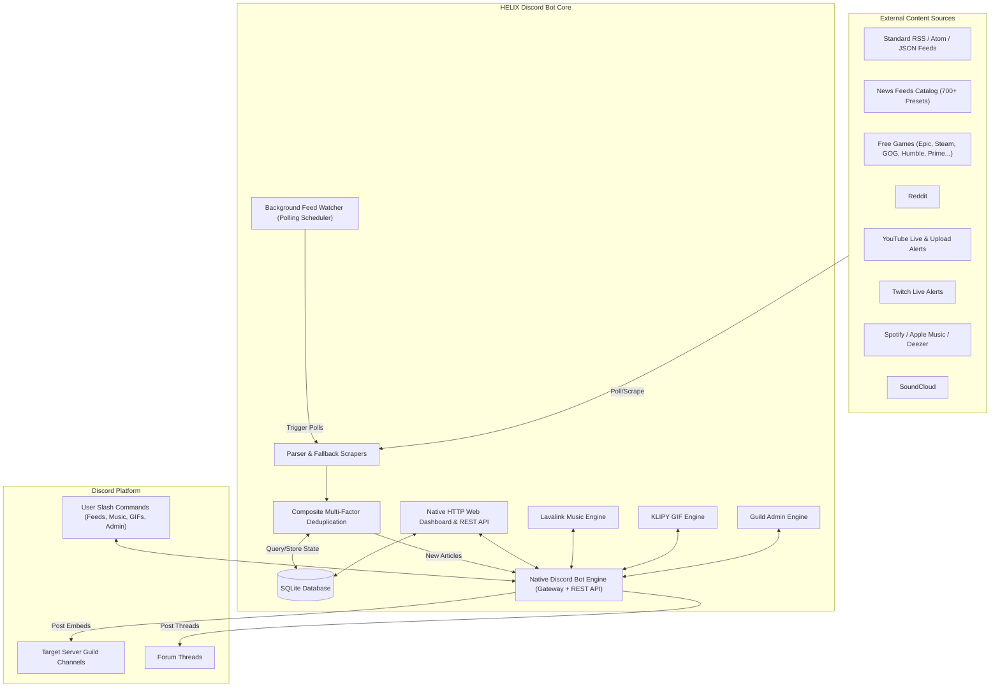

# 📖 HELIX Discord Bot Documentation Wiki

Welcome to the comprehensive technical and operational wiki for **HELIX Discord Bot** — the modern, high-performance RSS & web scraping feed delivery bot and web management dashboard for Discord communities.

---

## 🧭 Wiki Table of Contents

| Section | Description |
| :--- | :--- |
| [**📡 Feeds & Scrapers Engine**](Feeds-and-Scrapers.md) | Deep dive into XML/RSS/Atom parsing, Reddit, Free Games, and custom scrapers. |
| [**🎮 Free Games & Giveaways**](Free-Games-Feeds.md) | Multi-store aggregation (Epic Games, Steam, GOG, Humble, etc.), Monday cron scheduler, and store branding. |
| [**🤖 Reddit Feeds & Pure Image Mode**](Reddit-Feeds.md) | Reddit scraping, Pure Image Mode vs Standard RSS Mode, animated GIF/gifv banners, and subreddit filtering. |
| [**🤖 Discord Bot & Commands**](Discord-Bot.md) | Slash commands (`/feed`, `/stats`, `/about`, `/help`), direct channel + forum thread delivery, embed formatting, and Discord permissions. |
| [**🎵 Music & Lavalink**](Music.md) | External Lavalink v4 playback (YouTube, Spotify, SoundCloud, Apple Music, Deezer), queue management, and dashboard queue page. |
| [**😂 Entertainment & GIF Commands**](Entertainment.md) | KLIPY-powered `/gif` with autocomplete, action commands (`/slap`, `/hug`, etc.), and random GIF fallback. |
| [**🛡️ Guild Administration**](Administration.md) | Moderation (`/admin warn`, `/kick`, `/ban`, `/lock`, `/purge`, `/slowmode`, `/announce`), role management, voice controls, permission guards. |
| [**🔌 REST API Reference**](API-Reference.md) | Complete documentation of all REST endpoints, request/response schemas, and query params. |
| [**🏗️ Architecture & Design**](Architecture-and-Design.md) | System components, data flow diagrams, background polling engine, caching, and state management. |
| [**⚙️ Configuration Guide**](Configuration.md) | Exhaustive reference of all `.env` variables, timeouts, polling, dashboard themes, and hosting settings. |
| [**🚀 Deployment & Hosting**](Deployment-and-Hosting.md) | Deployment guides for Docker, Linux VPS/systemd, Windows, and manual Cloud PaaS (Railway, Render, Fly.io). |
| [**🧪 Development & Testing**](Development-and-Testing.md) | Local environment setup, test runner commands, TypeScript checking, and code style standards. |
| [**🔒 Integrations & Security**](Integrations-and-Security.md) | Discord OAuth2, Owner ID resolution, CSRF/XSS protection, rate limiting, and database security. |
| [**🩺 Troubleshooting & FAQ**](Troubleshooting.md) | Diagnostic flows for feed delivery failures, permission errors, Reddit 429s, and database locks. |

---

## 💡 Key System Highlights

### 🎯 Feature Overview
1. **Multi-Source Scraping**: Full native support for RSS 0.9x/1.0/2.0, Atom 1.0, JSON Feed, Reddit subreddits, and free games giveaways.
2. **Dedicated Free Games Aggregator**: Real-time promotions scraping across 10 major digital storefronts with store-specific badge icons and **daily** automated schedule with deduplication.
3. **Dedicated Reddit Engine**: Switch seamlessly between **Pure Image Mode** (fullscreen meme & photo banners) and **Standard RSS Mode** (discussion excerpts and link cards).
4. **News Feeds Catalog**: Instant 1-click subscription to 700+ verified feeds across 15 popular news categories.
5. **No Webhook Hassle**: Messages are dispatched directly to guild channels using Discord REST API endpoints with granular role/user pings and embed color customization.
6. **Forum Thread Delivery**: Optional per-server delivery of each feed into its own dedicated thread inside a forum channel — kept open via keepalive polling, auto-rotated into a fresh thread when large (configurable from the dashboard Feeds tab).
7. **Glassmorphism Web Dashboard**: Real-time management interface with Discord OAuth2 login, feed analytics, log streaming, and preset browsing.
8. **Music Playback via Lavalink**: High-quality music from YouTube, Spotify, SoundCloud, Apple Music, Deezer with queue management, shuffle/loop/volume/seek controls, and real-time dashboard queue page. Ships the official Lavalink v4 engine as a pre-built npm dependency (`@helix-origin/lavalink-server`, read-only pinned release tarball) embedded as the default node, or connects to an external Lavalink v4 server. All music configuration lives in the bot's global `.env`.
9. **Entertainment GIF Commands**: KLIPY-powered `/gif` with category autocomplete (anime, jojo, waifu, slap, etc.), action commands (`/slap`, `/hug`, `/kiss`, `/pat`, `/bonk`, etc.), and random GIF fallback.
10. **Guild Administration**: Moderation (`/admin warn`, `/kick`, `/ban`, `/lock`, `/purge`, `/slowmode`, `/announce`), role management, voice controls (mute/deafen/move/disconnect), all with Discord permission guards.
