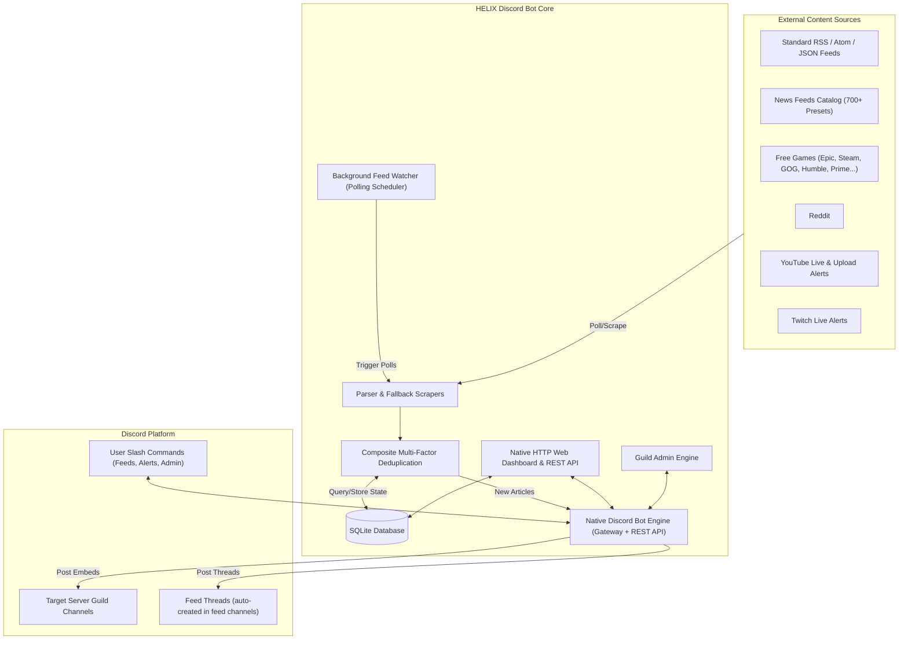

# 📖 HELIX Discord Bot Documentation Wiki

Welcome to the comprehensive technical and operational wiki for **HELIX Discord Bot** — the modern, high-performance RSS & web scraping feed delivery bot and web management dashboard for Discord communities.

---

## 🧭 Wiki Table of Contents

| Section | Description |
| :--- | :--- |
| [**📡 Feeds & Scrapers Engine**](Feeds-and-Scrapers) | Deep dive into XML/RSS/Atom parsing, Reddit, Free Games, and custom scrapers. |
| [**🎮 Free Games & Giveaways**](Free-Games-Feeds) | Multi-store aggregation (Epic Games, Steam, GOG, Humble, etc.), Monday cron scheduler, and store branding. |
| [**🤖 Reddit Feeds & Pure Image Mode**](Reddit-Feeds) | Reddit scraping, Pure Image Mode vs Standard RSS Mode, animated GIF/gifv banners, and subreddit filtering. |
| [**🤖 Discord Bot & Commands**](Discord-Bot) | Slash commands (`/rss`, `/youtube`, `/twitch`, `/free-games`, `/reddit`, `/welcome`, `/ticket`, `/set`, `/stats`, `/about`, `/help`), direct channel + dedicated thread delivery, embed formatting, and Discord permissions. |
| [**🛡️ Guild Administration**](Administration) | Moderation (`/warn`, `/kick`, `/ban`, `/lock`, `/purge`, `/slowmode`, `/announce`), Welcome Announcements, Support Tickets, role management, voice controls, permission guards. |
| [**🔌 REST API Reference**](API-Reference) | Complete documentation of all REST endpoints, request/response schemas, and query params. |
| [**🏗️ Architecture & Design**](Architecture-and-Design) | System components, data flow diagrams, background polling engine, caching, and state management. |
| [**⚙️ Configuration Guide**](Configuration) | Exhaustive reference of all `.env` variables, timeouts, polling, dashboard themes, and hosting settings. |
| [**🚀 Deployment & Hosting**](Deployment-and-Hosting) | Deployment guides for Docker, Linux VPS/systemd, Windows, and manual Cloud PaaS (Railway, Render, Fly.io). |
| [**🧪 Development & Testing**](Development-and-Testing) | Local environment setup, test runner commands, TypeScript checking, and code style standards. |
| [**🔒 Integrations & Security**](Integrations-and-Security) | Discord OAuth2, Owner ID resolution, CSRF/XSS protection, rate limiting, and database security. |
| [**🩺 Troubleshooting & FAQ**](Troubleshooting) | Diagnostic flows for feed delivery failures, permission errors, Reddit 429s, and database locks. |

---

## 💡 Key System Highlights

### 🎯 Feature Overview
1. **Multi-Source Scraping**: Full native support for RSS 0.9x/1.0/2.0, Atom 1.0, JSON Feed, Reddit subreddits, and free games giveaways.
2. **Dedicated Free Games Aggregator**: Real-time promotions scraping across 10 major digital storefronts with store-specific badge icons and automated schedules with deduplication.
3. **Dedicated Reddit Engine**: Switch seamlessly between **Pure Image Mode** (fullscreen meme & photo banners) and **Standard RSS Mode** (discussion excerpts and link cards), with automatic filtering of persistent community home posts.
4. **Real-Time Single-Newest-Post Delivery**: Feeds deliver strictly the single newest post per polling cycle and drain older backlog items, eliminating burst dumps and completely shielding channels from Discord rate limits.
5. **News Feeds Catalog**: Instant 1-click subscription to 700+ verified feeds across 15 popular news categories.
6. **No Webhook Hassle**: Messages are dispatched directly to guild channels using Discord REST API endpoints with granular role/user pings and embed color customization.
7. **Thread Delivery**: Optional per-server delivery of each feed into its own dedicated thread auto-created in the feed's text channel — kept open via keepalive polling, auto-rotated into a fresh thread when large (configurable from the dashboard Guild Admin → Feed Delivery).
8. **Glassmorphism Web Dashboard**: Real-time management interface with Discord OAuth2 login, responsive window-fitting layouts, live simulated Discord previews, feed analytics, log streaming, and preset browsing.
9. **Welcome & Ticket Systems**: Dedicated `/welcome` announcements and `/ticket` support system (channel button prompt with optional embeds, auto-creating threads with support manager role alerts, live Discord previews, and dynamic `{server}`, `{role}`, `{channel}`, `{membercount}`, `{user}`, `{mention}` placeholder interpolation).
10. **Guild Administration**: Moderation (`/warn`, `/kick`, `/ban`, `/lock`, `/purge`, `/slowmode`, `/announce`), role management, voice controls (mute/deafen/move/disconnect), all with Discord permission guards.
