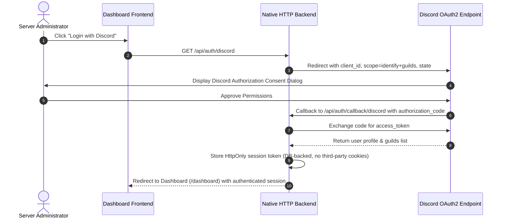

# 🔒 Integrations & Security

This guide details the security model, authentication flows, authorization rules, and data protection practices in HELIX Discord Bot.

---

## 🔑 Discord OAuth2 Authentication Workflow

---

## 🛡️ Role-Based Access Control (RBAC)

1. **Server Administrator Authorization**:
   - Only users with the `Administrator` or `Manage Server` (`MANAGE_GUILD`) permissions on a given Discord server can view, create, edit, or delete feeds for that server.
   - Server lists are verified server-side on every API call against Discord's `/users/@me/guilds` endpoint.

2. **Global Application Owners / Team**:
   - The Discord application's **owner and team members** are detected automatically (Discord Developer Portal Application info) and granted the `owner` role, which unlocks the Developer Tools, Service Logs, and global system settings. No manual `OWNER_IDS` list is required.

---

## 🛡️ Application Hardening & Security Standards

### 1. Direct Discord REST Delivery
- Rather than relying on public incoming webhooks (which can be leaked or hijacked if tokens are exposed), all deliveries use Discord's official REST API (`POST /channels/{channelId}/messages`) authorized with the bot's secret token.

### 2. Cross-Site Scripting (XSS) & HTML Sanitization
- All RSS descriptions and article snippets extracted from untrusted third-party web feeds are passed through an HTML entity decoder and strict HTML tag stripper before being formatted into Discord embeds or web UI cards.

### 3. Request Validation & API Hardening
- The native HTTP router validates request bodies and content types on every mutating endpoint, and Discord interaction responses include state checks and expiry handling. Verified HTTP redirect/state parameters prevent OAuth code injection. Discord API 429/rate-limit responses are surfaced to the operator in the service logs.

### 4. Database Parameterization
- All queries to SQLite use prepared parameterized statements, preventing SQL injection vulnerabilities.
