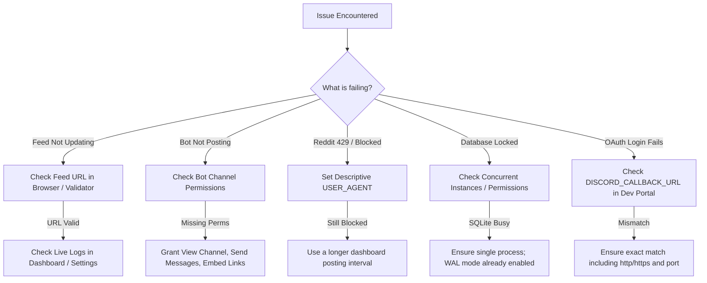

# 🩺 Troubleshooting & Frequently Asked Questions

This guide provides diagnostic steps and solutions for common issues encountered when running, deploying, or configuring HELIX Discord Bot.

---

## 🔍 Diagnostic Decision Flowchart



---

## 🎵 Lavalink / Music Playback Issues

### 1. Lavalink Node Not Starting (Embedded Mode)

**Symptoms**: `/play` commands fail, logs show `Lavalink connection refused` or WebSocket handshake failures.

**Solutions**:
1. **Verify Lavalink v4 server is running**: Ensure your external Lavalink v4 instance is reachable on the configured host and port.
2. **Verify `.env` configuration**: Check that `LAVA_HOST`, `LAVA_PORT`, `LAVA_PASS`, and `LAVA_SECURE` match your server's configuration.
3. **Firewall / Network access**: Ensure port 2333 (or your custom port) is accessible between the bot and the Lavalink server.
4. **Password mismatch**: Ensure `LAVA_PASS` matches the password configured in the Lavalink server.
5. **Secure WebSocket**: If the server uses TLS (`wss://`), ensure `LAVA_SECURE=true`.

### 3. No Audio / Track Stuck

**Symptoms**: Track shows as playing but no audio in voice channel.

**Solutions**:
1. **Voice gateway**: Ensure bot has `Connect`, `Speak`, `Use Voice Activity` permissions in the voice channel.
2. **Lavalink version**: Embedded node uses Lavalink v4. External node must be v4 compatible.
3. **Restart voice connection**: Use `/leave` then `/play` again to re-establish voice WebSocket.

### 4. Java Missing / Wrong Version

**Symptoms**: `java: command not found` or `UnsupportedClassVersionError`.

**Solutions**:
1. Install Java 21+ (not Java 17 or 8).
2. Add Java to system PATH.
3. Verify with `java --version` showing 21.x.

---

## ⚠️ Common Problems & Resolutions

### 1. Bot is Not Posting Feed Updates to Channel

**Symptoms**: Feeds appear active in the dashboard, but no messages appear in Discord.

**Solutions**:
1. **Verify Bot Channel Permissions**: Ensure the bot has `View Channel`, `Send Messages`, and `Embed Links` in the specific target channel or category overrides.
2. **Send a Test Message**: In the dashboard, click the **Send Test** button on the feed card. If an error is returned, review the error code (e.g. `50001: Missing Access` or `50013: Missing Permissions`).
3. **Check Feed Polling Timestamp**: Inspect `lastPolledAt` to ensure the background watcher loop is running.

---

### 2. Reddit Feeds Return `429 Too Many Requests`

**Symptoms**: Reddit feeds fail to refresh and logs show HTTP 429 status.

**Solutions**:
1. Configure a descriptive User-Agent in `.env`:
   ```env
   USER_AGENT="HelixRSS/0.1.0 (by /u/YourRedditUsername)"
   ```
2. Avoid short delivery intervals for Reddit feeds — use the dashboard's 10–60 minute posting options for high-volume subscriptions.
3. If monitoring multiple subreddits, combine them into a single multi-reddit feed (`r/sub1+sub2+sub3`) instead of creating separate feeds.

---

### 3. OAuth2 "Invalid OAuth2 Redirect URL"

**Symptoms**: Clicking "Login with Discord" redirects to a Discord error page saying the redirect URL is invalid.

**Solutions**:
1. Open the [Discord Developer Portal](https://discord.com/developers/applications).
2. Select your application and navigate to **OAuth2 -> General**.
3. Under **Redirects**, add the exact redirect URI matching `DISCORD_CALLBACK_URL` (e.g., `http://localhost:3131/api/auth/callback/discord` or `https://rss.yourdomain.com/api/auth/callback/discord`).
4. Ensure trailing slashes and HTTP vs HTTPS protocols match exactly.

---

### 4. SQLite `database is locked` / `SQLITE_BUSY`

**Symptoms**: Log contains `Error: SQLITE_BUSY: database is locked`.

**Solutions**:
1. Ensure only **one instance** of HELIX Discord Bot is accessing the SQLite database file at a time (e.g., avoid running multiple containers sharing the same volume without clustering).
2. The database runs in **WAL mode** (`PRAGMA journal_mode = WAL`), which already mitigates most read/write contention. SQLite is the only supported engine.

---

### 5. Free Games Feed Not Announcing Giveaways

**Symptoms**: A new free game promotion is live on Epic Games Store or Steam, but no message has been sent.

**Solutions**:
1. Free Games feeds run on an automated **daily** polling schedule.
2. Verify that `FREE_GAMES_MIN_PRICE=0` in `.env` (if set higher, deals below that original retail price are filtered out).
3. Check the Service Logs for any source errors or rate-limit responses.

---

## ❓ Frequently Asked Questions (FAQ)

<details>
<summary><strong>Q: Does HELIX Discord Bot require webhook URLs for each channel?</strong></summary>

> **No**. HELIX Discord Bot connects directly using the Discord Bot Token and Discord REST API. You only need to select target channels from the dropdown.
</details>

<details>
<summary><strong>Q: Can I format Reddit feeds to only post the image banner without text?</strong></summary>

> **Yes!** In the Reddit Feeds tab, toggle the mode switcher to **Pure Image Mode** (`feedType: 'reddit'`).
</details>

<details>
<summary><strong>Q: How many feeds can I add to a single server?</strong></summary>

> There is no hardcoded software limit. Thousands of feeds can be tracked concurrently with appropriate `FEED_CONCURRENCY` and memory allocation.
</details>
